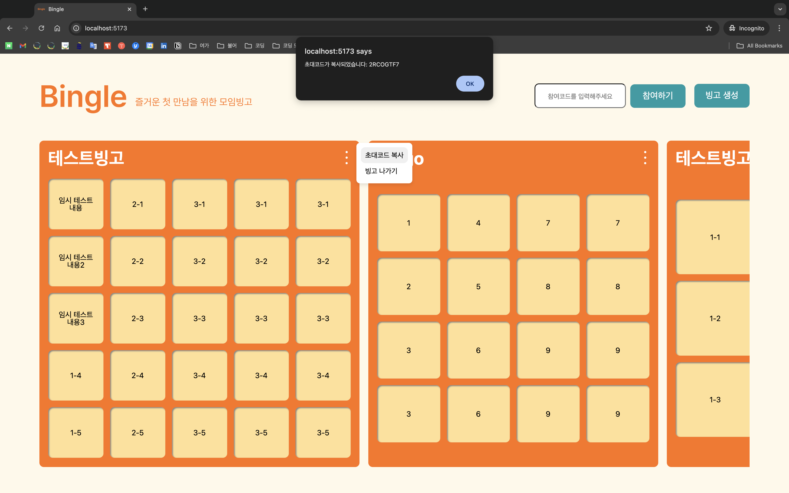
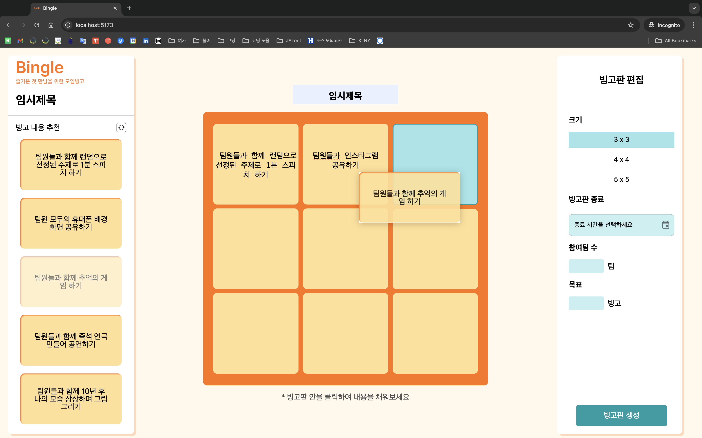

# Bingle 🎉  
**Bingo + Mingle = Bingle!**  
모임별로 빙고를 만들어 다양한 미션을 해결하며 자연스럽게 친목을 다질 수 있도록 돕는 아이스 브레이킹 서비스입니다.

---

## 주요 기능 🚀

### 1. 드래그 앤 드롭 빙고 제작 ✨  
Google Gemini API를 통해 추천받은 미션들을 **드래그 앤 드롭(grab and drop)** 라이브러리를 활용하여 손쉽게 빙고에 추가할 수 있습니다.  

### 2. 간편 로그인 🛠️  
**카카오 API**를 이용한 소셜 로그인 기능으로 빠르고 간편하게 서비스를 이용할 수 있습니다.  

### 3. 팀 빙고 현황 확인 📊  
팀별 빙고 달성 현황을 한눈에 확인할 수 있어, 팀 간 경쟁과 협업이 가능합니다.  

### 4. 빙고 이미지 저장 📸  
현재 진행 중인 빙고를 **이미지로 저장**하여 공유하거나 기록으로 남길 수 있습니다.  

### 5. 초대 코드로 팀원 초대 🔗  
빙고에 **초대 코드**를 사용해 팀원을 쉽게 초대할 수 있습니다.  

---

## 기술 스택 🛠️

### Frontend  
- **React**  
- **TypeScript**  
- **Vite**  
- **React DnD** (드래그 앤 드롭 구현)

### Backend  
- **Django**  
- **DRF**  
- **Google Gemini API** (미션 추천 기능)  
- **Kakao API** (소셜 로그인)  

### Deployment  
- **AWS** (S3, EC2) : Closed

---

## 팀 구성 👩‍💻
- Frontend: 안소현, 조민정
- Backend: 김수미, 서은비
- UI/UX Design: 김민진

---

## 화면 예시 🖥️

